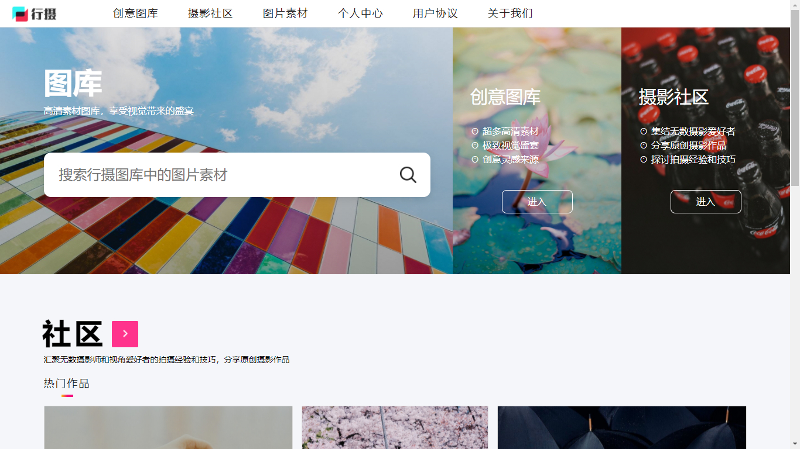
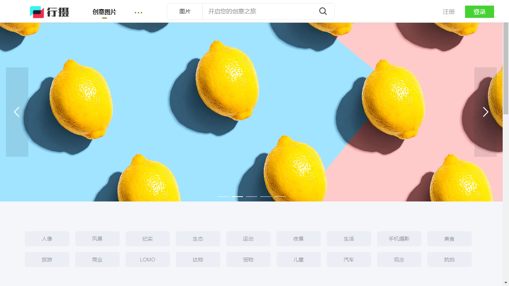
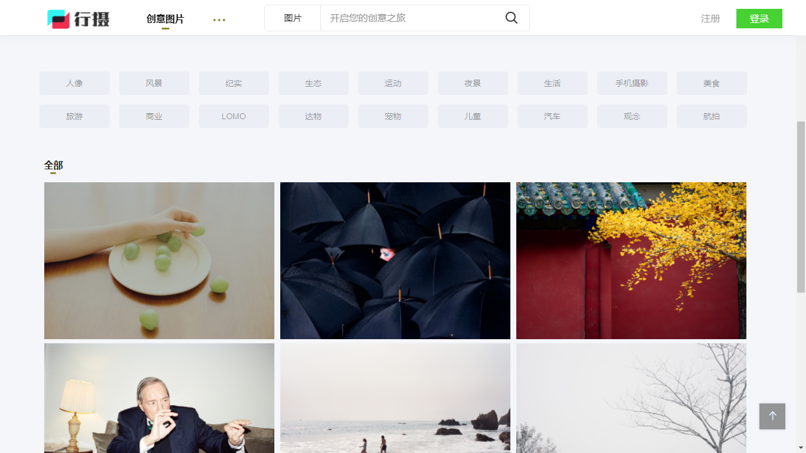
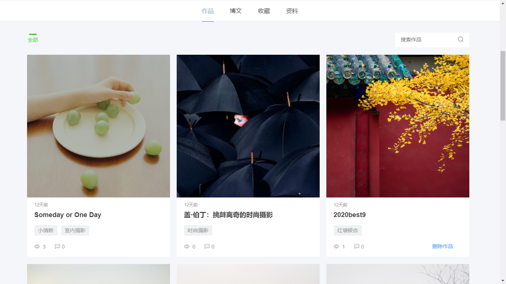
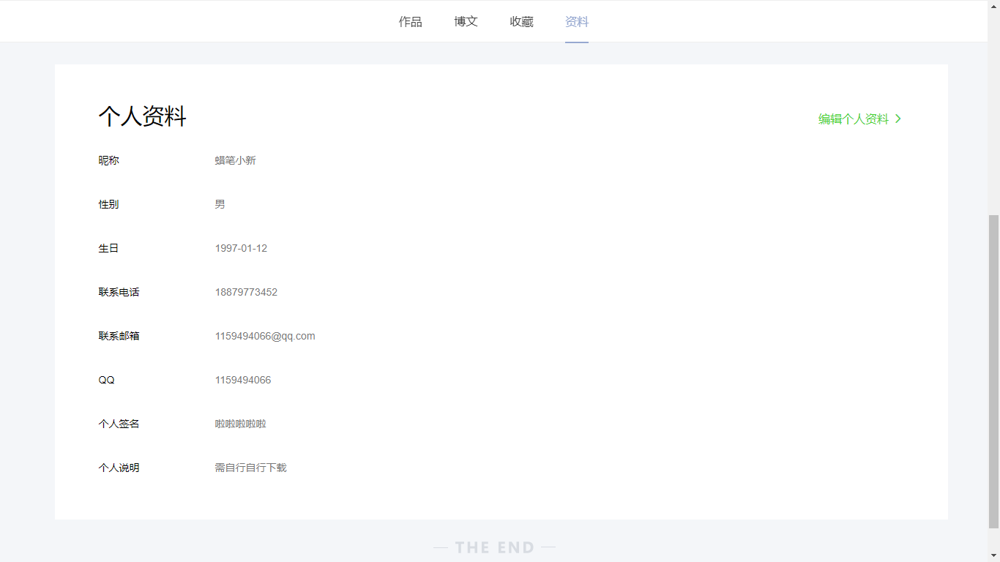
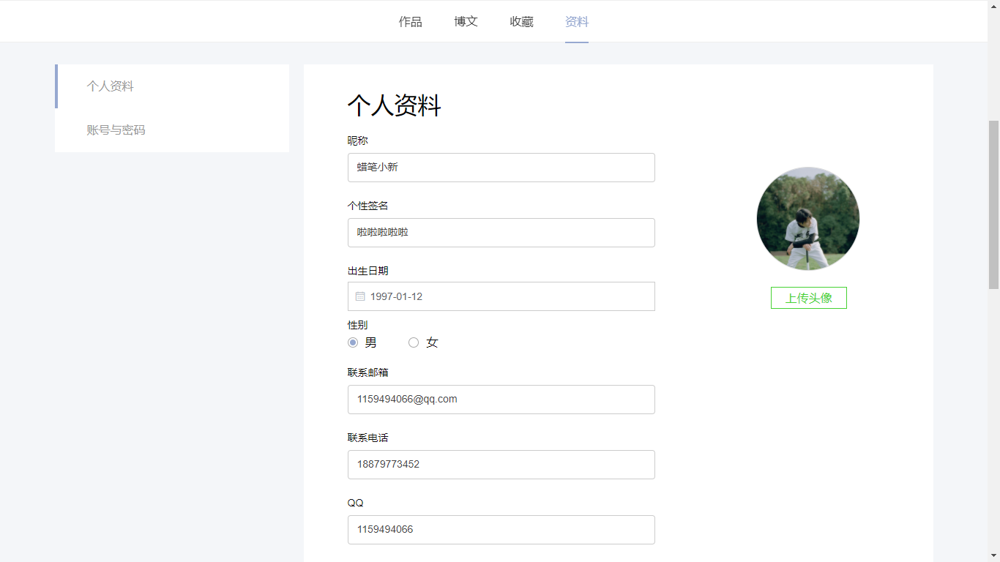
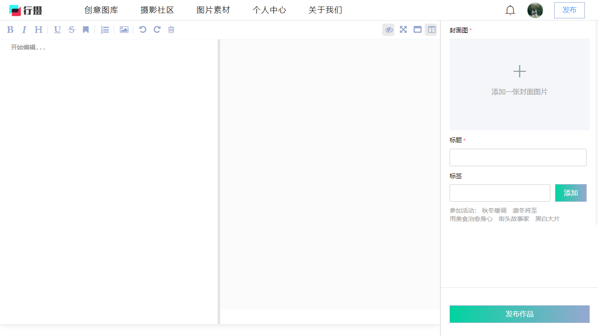
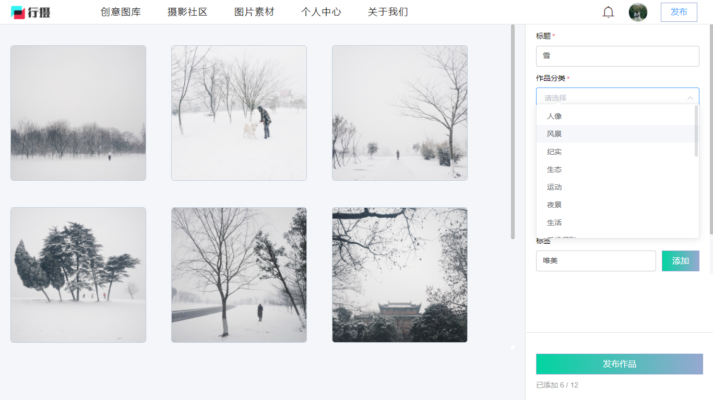
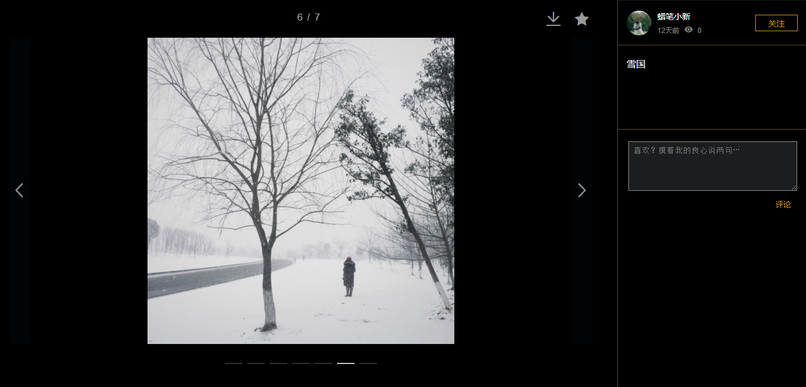

# 行摄网-视觉爱好者交流社区（前端）

#### 介绍
本项目是一个以分享原创摄影作品为核心的分享社区系统，摄影爱好者可以通过本网站分享自己的摄影作品和拍摄技巧，也 可以借此网站获取自己所需的有关摄影的信息。

#### 链接
行摄网-视觉爱好者交流社区：http://wind.yongkj.cn

#### 截图

#### 技术栈

SpringBoot+MyBatis+MySQL+Vue+Redis

1. 使用基于 Vue 的开源 Markdown编辑器 mavonEditor实现文章的发布与查看功能 
2. 通过添加 CORS 全局配置解决跨域访问，实现项目的前后端分离 
3. 使用 JWT 实现用户的跨域身份验证功能，提高访问的安全性 
4. 采用 JavaMail 来完成邮箱的邮件发送功能 
5. 采用Redis来完成分布式缓存

#### 功能特性

1. 需要使用邮箱地址并获取邮箱验证码才能注册新账号，另外，管理员账号可以对用户账号进行管理
2. 首页展示热门作品，可进入摄影社区以及创意图库，还可以搜索图库中的图片素材
3. 创意图库包含所有已发表的作品，用户可根据分类选择浏览作品，也可对作品进行搜索
4. 点击图片可对图片作品进行详细操作，包括放大图片、幻灯片播放、翻转图片等
5. 摄影社区包含已发表的博文，包括一周热文，另外可以对博文进行关键字搜索
6. 个人中心包含作品、博文、收藏和资料，用户可以查看或删除发表过的作品或博文
7. 作品发表页面，支持图片的拖动选择或点击选择，描述作品的特色，选择作品分类等
8. 博文的发表包括使用markdown语法对博文进行编辑，添加封面图片、编写标题信息和标签信息等

####  使用说明

1. 此项目为 Vue 项目，需安装 Vue CLI 2 项目脚手架以及下载 node 模块才能正常使用
2. 如需打包部署服务器，则可以使用 npm 命令打包项目

